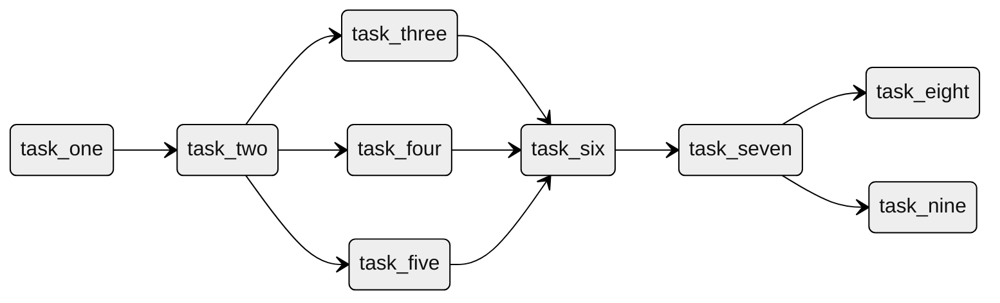

# Python DAG Runner


[](https://opensource.org/licenses/MIT)

Python DAG Runner is a Python library for running Directed Acyclic Graphs (DAGs) efficiently. It provides a simple and intuitive interface for defining and executing complex workflows. It uses networkx library to generate directed acyclic graph from the tasks and it's dependencies.

## Installation
You can install python-dag-runner library easily using pip:
```bash
pip install python-dag-runner
```

## Usage
You can easily define a dag in python-dag-runner using Dag class. Furthermore, task can be defined using Task class. You can easily define dependencies of tasks using the "|=" operator.
```python
from python_dag_runner import Dag, Task

# Create an executable function
def print_task_1():
    """A sample function"""
    print("Task 1 called")

def print_task_1():
    """A sample function"""
    print("Task 2 called")

# Create Task objects
task_1 = Task(name="task one", executable=print_task_1)
task_2 = Task(name="task two", executable=print_task_2)

# Set dependencies of task using bitwise or operator
task_2 |= {task_1}

# Create a DAG by providing name and sequence of tasks
dag = Dag("My first DAG", tasks=[task_1, task_2])

# Initiate execution of Dag using initialize method
dag.initiate()
```

## Example of complex dependencies
Multiple internal dependencies can be defined using dependency operator.
```python
task_2 |= {task_1}
task_3 |= {task_2}
task_4 |= {task_2}
task_5 |= {task_2}
task_6 |= {task_3, task_4, task_5}
task_7 |= {task_6}
task_8 |= {task_7}
task_9 |= {task_7}
```

The above steps result in the dependency graph as shown below

